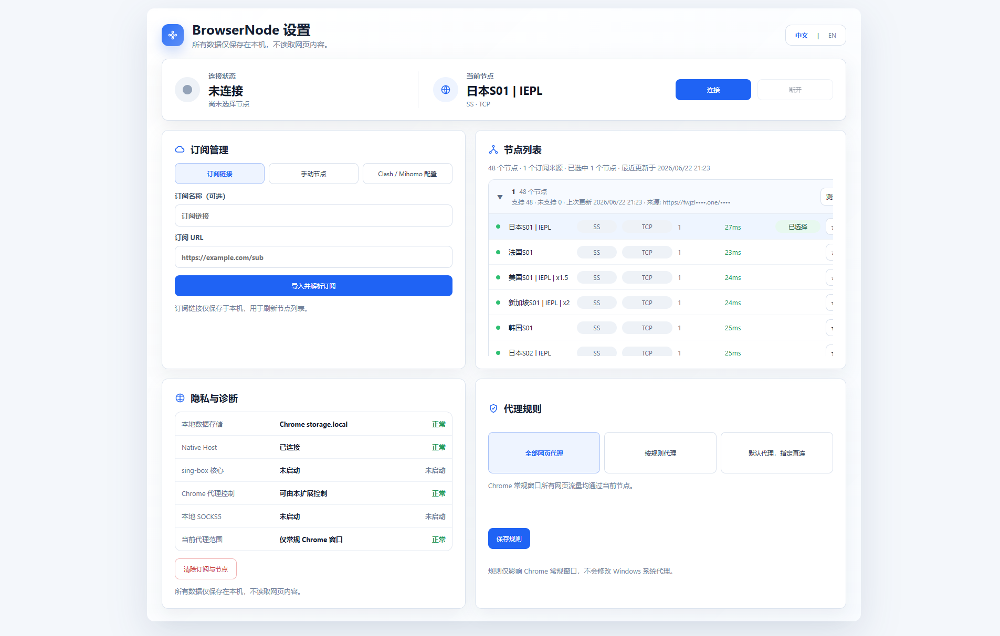

# BrowserVPN-Chrome

[中文](README.md) | [English](README.en.md)

BrowserVPN-Chrome 是一个面向 Windows + Chrome 的本地代理/VPN 工具。它由 Chrome 扩展、Native Host 和 `sing-box` 组成，支持订阅导入、节点测速、节点选择、连接和断开，仅控制 Chrome 常规窗口代理，不修改 Windows 系统代理。

本项目为 source-available / noncommercial 项目，仅允许非商业用途。使用者必须遵守所在地法律法规，使用风险和后果自行承担。



## 功能

- Chrome 代理/VPN 扩展，本机运行 `sing-box`。
- 支持订阅 URL、手动节点、Clash / Mihomo `proxies` 配置导入。
- 支持常见 VLESS、VMess、Trojan、Shadowsocks 节点。
- 按订阅来源分组展示节点，支持单组节点测速。
- 支持全局代理、按规则代理、默认代理加指定直连。
- 点击断开后自动停止本地代理核心。
- 订阅和节点数据保存在本机 Chrome `storage.local`，不读取网页内容。

## 支持

| 项目 | 支持 |
| --- | --- |
| 系统 | Windows 10 / 11 |
| 浏览器 | Google Chrome / Chromium |
| 代理核心 | sing-box |
| 本地代理 | SOCKS5 |
| 协议 | VLESS, VMess, Trojan, Shadowsocks |
| 配置格式 | 订阅 URL, Clash / Mihomo YAML |

## 安装

下载或克隆仓库后，双击运行：

```text
install\一键安装-BrowserVPN-Chrome.bat
```

安装脚本会自动：

- 检查或安装 Node.js、npm、Go。
- 构建 Chrome 扩展。
- 生成 `BrowserVPN-Chrome-Extension` 目录。
- 下载并安装 `sing-box.exe`。
- 编译并注册 Native Host。
- 打开 Chrome 扩展管理页。

如果双击被系统拦截，可以在 PowerShell 中运行：

```powershell
powershell -NoProfile -ExecutionPolicy Bypass -File .\install\setup-browservpn-chrome.ps1
```

## 加载扩展

1. 打开 `chrome://extensions`。
2. 开启“开发者模式”。
3. 点击“加载已解压的扩展程序”。
4. 选择仓库根目录下的 `BrowserVPN-Chrome-Extension`。
5. 打开 BrowserVPN-Chrome 扩展设置页。

## 使用

1. 在“订阅管理”中导入订阅链接，或添加手动节点。
2. 在“节点列表”中展开订阅组。
3. 点击当前组的“测速”按钮。
4. 选择一个节点。
5. 点击顶部“连接”。
6. 不需要代理时点击“断开”。

重启电脑后不需要手动启动 `sing-box.exe` 或 Native Host。打开 Chrome 后，在 BrowserVPN-Chrome 中点击“连接”即可。

## 从源码构建

```powershell
cd source\apps\extension
npm install
npm run build
npm test
```

扩展构建产物位于：

```text
source\apps\extension\dist
```

一键安装脚本会复制到：

```text
BrowserVPN-Chrome-Extension
```

## 卸载

1. 在扩展中点击“断开”。
2. 在 Chrome 扩展管理页移除 BrowserVPN-Chrome。
3. 运行：

```powershell
powershell -ExecutionPolicy Bypass -File .\source\installer\scripts\uninstall-host.ps1
```

4. 可手动删除本机安装目录：

```text
%LOCALAPPDATA%\BrowserVPN-Chrome
```

## 隐私

- 不读取网页内容。
- 不注入网页脚本。
- 不上传订阅、节点或测速结果。
- 仅控制 Chrome 常规窗口代理。

## 许可证

本项目使用 [PolyForm Noncommercial License 1.0.0](LICENSE)。

允许非商业用途下的学习、研究、修改和分发。禁止商业用途。软件按“原样”提供，不提供任何担保。

Copyright (C) 2026 zhituo wei
